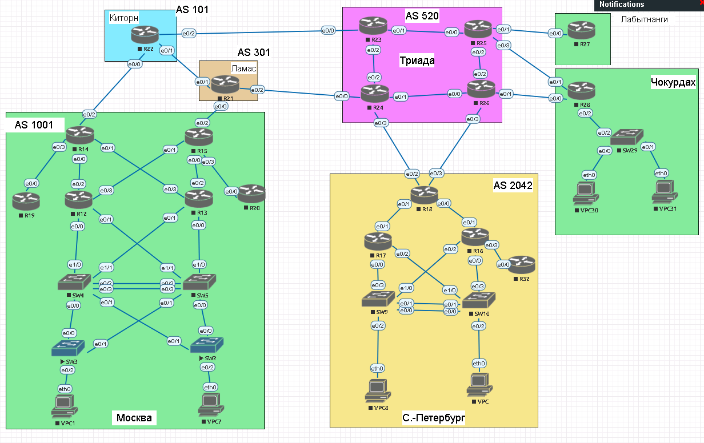
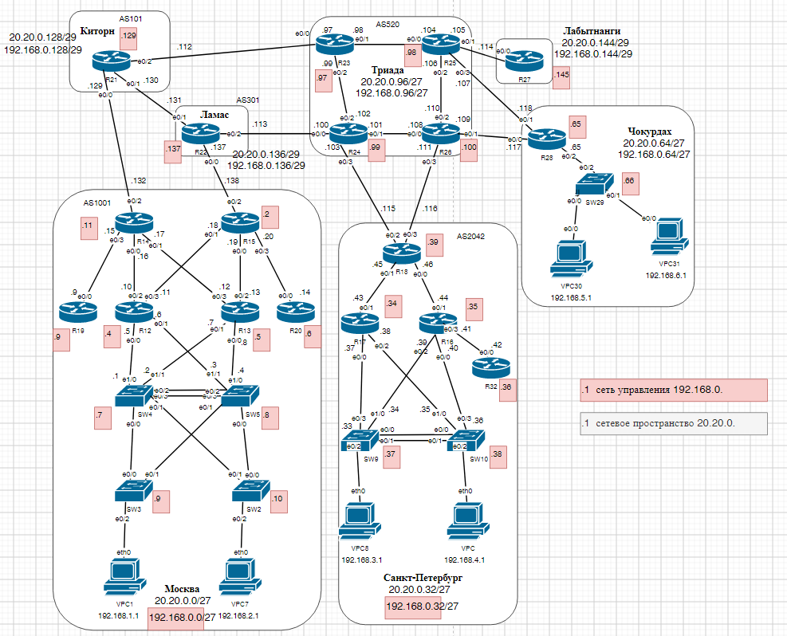

#  Проектирование сети

#  Цель:

Распланировать адресное пространство, настроить IP на активных портах для дальнейшей работы над проектом и задокументировать адресацию.

###  Задание:

  1. Разработаете и задокументируете адресное пространство для лабораторного стенда.
  2. Настроите ip адреса на каждом активном порту
  3. Настроите каждый VPC в каждом офисе в своем VLAN.
  4. Настроите VLAN/Loopbackup interface управления для сетевых устройств
  5. Настроите сети офисов так, чтобы не возникало broadcast штормов, а использование линков было максимально оптимизировано
      Используете IPv4. IPv6 по желанию

## Схема лабораторной работы:


Таблица статических маршрутов.

На все предприятие выделен диапазон 20.20.0.0./16

Делим его на подсети.

| Устройство  | Интерфейс | Адрес              | Шлюз                |  Комментарий                       |
|-----|------|--------------------------|------------------------|--------------------------------------|
| Москва | |                |           | 20.20.0.0/27 0-31 рабочая 1-30                        |
|R12 |e0/0 | 20.20.0.5      |           | -> e1/0 SW4                        |
|    |e0/1 | 20.20.0.6      |           | -> e1/1 SW5                        |
|    |e0/2 | 20.20.0.10     |           | -> e0/0 R14                        |
|    |e0/3 | 20.20.0.11     |           | -> e0/1 R15                        |
|    |lo0  | 192.168.0.4    |           |                                    |
|R13 |e0/0 | 20.20.0.8      |           | -> e1/0 SW5                        |
|    |e0/1 | 20.20.0.7      |           | -> e1/1 SW4                        |
|    |e0/2 | 20.20.0.13     |           | -> e0/0 R15                        |
|    |e0/3 | 20.20.0.12     |           | -> e0/1 R14                        |
|    |lo0  | 192.168.0.5    |           |                                    |
|R14 |e0/0 | 20.20.0.16     |           | -> e0/2 R12                        |
|    |e0/1 | 20.20.0.17     |           | -> e0/3 R13                        |
|    |e0/2 | 20.20.0.132    |           | -> e0/0 R22                        |
|    |e0/3 | 20.20.0.15     |           | -> e0/0 R19                        |
|    |lo0  | 192.168.0.11   |           |                                    |
|R15 |e0/0 | 20.20.0.19     |           | -> e0/2 R13                        |
|    |e0/1 | 20.20.0.18     |           | -> e0/3 R12                        |
|    |e0/2 | 20.20.0.138    |           | -> e0/0 R21                        |
|    |e0/3 | 20.20.0.20     |           | -> e0/0 R20                        |
|    |lo0  | 192.168.0.2    |           |                                    |
|R19 |e0/0 | 20.20.0.9      |           | -> e0/3 R14                        |
|    |lo0  | 192.168.0.3    |           |                                    |
|R20 |e0/0 | 20.20.0.14     |           | -> e0/3 R15                        |
|    |lo0  | 192.168.0.6    |           |                                    |
|SW2 |lo0  | 192.168.0.10   |           |                                    |
|SW3 |lo0  | 192.168.0.9    |           |                                    |
|SW4 |e1/0 | 20.20.0.1      |           | -> e0/0 R12                        |
|    |e1/1 | 20.20.0.2      |           | -> e0/1 R13                        |
|    |lo0  | 192.168.0.7    |           |                                    |
|SW5 |e1/0 | 20.20.0.4      |           | -> e0/0 R13                        |
|    |e1/1 | 20.20.0.3      |           | -> e0/1 R12                        |
|    |lo0  | 192.168.0.8    |           |                                    |
|VPC1|eth0 | 192.168.1.2    |192.168.1.1| -> e0/2 SW3                        |
|VPC7|eth0 | 192.168.2.2    |192.168.2.1| -> e0/2 SW2                        |
|-----|------|--------------------------|------------------------|--------------------------------------|
| Санкт-Петербург|  |                |        | 20.20.0.32/27 32-63 рабочая 33-62                        |
|-----|------|--------------------------|------------------------|--------------------------------------|
|R16 |e0/0 | 20.20.0.40     |           | -> e0/3 SW10                       |
|    |e0/1 | 20.20.0.44     |           | -> e0/0 R18                        |
|    |e0/2 | 20.20.0.39     |           | -> e1/0 SW9                        |
|    |e0/3 | 20.20.0.41     |           | -> e0/0 R32                        |
|    |lo0  | 192.168.0.35   |           |                                    |
|R17 |e0/0 | 20.20.0.37     |           | -> e0/3 SW9                        |
|    |e0/1 | 20.20.0.43     |           | -> e0/1 R18                        |
|    |e0/2 | 20.20.0.38     |           | -> e1/0 SW10                       |
|    |lo0  | 192.168.0.34   |           |                                    |
|R18 |e0/0 | 20.20.0.46     |           | -> e0/1 R16                        |
|    |e0/1 | 20.20.0.45     |           | -> e0/1 R17                        |
|    |e0/2 | 20.20.0.115    |           | -> e0/3 R24                        |
|    |e0/3 | 20.20.0.116    |           | -> e0/3 R26                        |
|    |lo0  | 192.168.0.39   |           |                                    |
|R32 |e0/0 | 20.20.0.42     |           | -> e0/3 R16                        |
|    |lo0  | 192.168.0.36   |           |                                    |
|SW9 |e0/3 | 20.20.0.33     |           | -> e0/0 R17                        |
|    |e1/0 | 20.20.0.34     |           | -> e0/2 R16                        |
|    |lo0  | 192.168.0.37   |           |                                    |
|SW10|e0/3 | 20.20.0.36     |           | -> e0/0 R16                        |
|    |e1/0 | 20.20.0.35     |           | -> e0/2 R17                        |
|    |lo0  | 192.168.0.38   |           |                                    |
|VPC8|eth0 | 192.168.3.2    |192.168.3.1| -> e0/2 SW9                        |
|VPC |eth0 | 192.168.4.2    |192.168.4.1| -> e0/2 SW10                       |
|-----|------|--------------------------|------------------------|--------------------------------------|
| Чокурдах|  |              |        | 20.20.0.64/27 64-95 рабочая 65-94                        |
|-----|------|--------------------------|------------------------|--------------------------------------|
|R28  |e0/0 | 20.20.0.117   |        | -> e0/1 R26                        |
|     |e0/1 | 20.20.0.118   |        | -> e0/3 R25                        |
|     |e0/2 | 20.20.0.65    |        | -> e0/2 SW29                       |
|     |lo0  | 192.168.0.65  |        |                                    |
|SW29 |lo0  | 192.168.0.66  |        |                                    |
|VPC30|eth0 | 192.168.5.2   |        | -> e0/0 SW29                       |
|VPC31|eth0 | 192.168.6.2   |        | -> e0/1 SW29                       |
|-----|------|--------------------------|------------------------|--------------------------------------|
| Триада|  |                |        | 20.20.0.96/27 96-127 рабочая 97-126                        |
|-----|------|--------------------------|------------------------|--------------------------------------|
|R23 |e0/0 | 20.20.0.97     |        | -> e0/2 R22                        |
|    |e0/1 | 20.20.0.98     |        | -> e0/0 R25                        |
|    |e0/2 | 20.20.0.99     |        | -> e0/2 R24                        |
|    |lo0  | 192.168.0.97   |        |                                    |
|R24 |e0/0 | 20.20.0.100    |        | -> e0/2 R21                        |
|    |e0/1 | 20.20.0.101    |        | -> e0/0 R26                        |
|    |e0/2 | 20.20.0.102    |        | -> e0/2 R23                        |
|    |e0/3 | 20.20.0.103    |        | -> e0/2 R18                        |
|    |lo0  | 192.168.0.99   |        |                                    |
|R25 |e0/0 | 20.20.0.104    |        | -> e0/1 R23                        |
|    |e0/1 | 20.20.0.105    |        | -> e0/0 R27                        |
|    |e0/2 | 20.20.0.106    |        | -> e0/2 R26                        |
|    |e0/3 | 20.20.0.107    |        | -> e0/1 R28                        |
|    |lo0  | 192.168.0.98   |        |                                    |
|R26 |e0/0 | 20.20.0.108    |        | -> e0/1 R24                        |
|    |e0/1 | 20.20.0.109    |        | -> e0/0 R28                        |
|    |e0/2 | 20.20.0.110    |        | -> e0/2 R25                        |
|    |e0/3 | 20.20.0.111    |        | -> e0/3 R18                        |
|    |lo0  | 192.168.0.100  |        |                                    |
|-----|------|--------------------------|------------------------|--------------------------------------|
| Киторн|  |                |        | 20.20.0.128/29 128-135 рабочая 129-134                        |
|-----|------|--------------------------|------------------------|--------------------------------------|
|R22 |e0/0 | 20.20.0.129    |        | -> e0/2 R14                        |
|    |e0/1 | 20.20.0.130    |        | -> e0/1 R21                        |
|    |e0/2 | 20.20.0.112    |        | -> e0/0 R23                        |
|    |lo0  | 192.168.0.129  |        |                                    |
|-----|------|--------------------------|------------------------|--------------------------------------|
| Ламас|  |                 |        | 20.20.0.136/29 136-143 рабочая 137-142                        |
|-----|------|--------------------------|------------------------|--------------------------------------|
|R21 |e0/0 | 20.20.0.137    |        | -> e0/2 R15                        |
|    |e0/1 | 20.20.0.131    |        | -> e0/1 R22                        |
|    |e0/2 | 20.20.0.113    |        | -> e0/0 R24                        |
|    |lo0  | 192.168.0.137  |        |                         |
|-----|------|--------------------------|------------------------|--------------------------------------|
| Лабытнанги|  |            |        | 20.20.0.136/29 136-143 рабочая 137-142                        |
|-----|------|--------------------------|------------------------|--------------------------------------|
|R27 |e0/0 | 20.20.0.114    |        | -> e0/1 R25                        |
|    |lo0  | 192.168.0.145  |        |                        |

#### Адресация компьютеров

| VLAN  | Устройство | IP адрес              | Маска                | 
|-----|------|--------------------------|------------------------|
|VLAN 10 |VPC1  |192.168.1.2|255.255.255.0        |  
|VLAN 20 |VPC7  |192.168.2.2|255.255.255.0        |  
|VLAN 30 |VPC8  |192.168.3.2|255.255.255.0        |  
|VLAN 40 |VPC   |192.168.4.2|255.255.255.0        |  
|VLAN 50 |VPC30 |192.168.5.2|255.255.255.0        |  
|        |VPC31 |192.168.5.3|255.255.255.0        |  


#### Технические VLAN

| VLAN  | Город | IP адрес              | Маска                | 
|-----|------|--------------------------|------------------------|
|VLAN 100|Management       | |         |  
|        |Москва           | 192.168.0.0  | 255.255.255.224        |  
|        |Санкт-Петербург  | 192.168.0.32 | 255.255.255.224        |  
|        |Чокурдах         | 192.168.0.64 | 255.255.255.224        | 
|        |Триада           | 192.168.0.96 | 255.255.255.224        | 
|        |Киторн           | 192.168.0.128| 255.255.255.248        | 
|        |Ламас            | 192.168.0.136| 255.255.255.248        | 
|        |Лабытнанги       | 192.168.0.144| 255.255.255.248        | 
|VLAN 999|NATIVE           | |        | 


#### Настройка компьютеров на примере Москва - VPS1
```
VPCS> ip 192.168.1.2/24 192.168.1.1
Checking for duplicate address...
VPCS : 192.168.1.2 255.255.255.0 gateway 192.168.1.1

VPCS>
```
#### Первичная настройка устройств
Инициализация 
```
Switch>enable
Switch#erase startup-config
Erasing the nvram filesystem will remove all configuration files! Continue? [confirm]
[OK]
Erase of nvram: complete
Switch#reload
Proceed with reload? [confirm]
```
#### Настройка на примере Москва - SW3
Настройка основных параметров
```
Switch>enable
Switch#configure terminal
Enter configuration commands, one per line.  End with CNTL/Z.
Switch(config)#hostname SW3
SW3(config)#no ip domain-lookup
SW3(config)#enable secret class
SW3(config)#line con 0
SW3(config-line)#password cisco
SW3(config-line)#login
SW3(config-line)#exit
SW3(config)#line vty 0 4
SW3(config-line)#password cisco
SW3(config-line)#login
SW3(config-line)#exit
SW3(config)#service password-encryption
SW3(config)#banner motd #
Enter TEXT message.  End with the character '#'.
Prohibiting unauthorized access to the device!!!! #
SW3(config)#exit
SW3#copy running-config startup-config
Destination filename [startup-config]?
*Oct  2 11:36:13.247: %SYS-5-CONFIG_I: Configured from console by console

Building configuration...
Compressed configuration from 899 bytes to 658 bytes[OK]
SW3#
```
Настройка VLAN
```
SW3#conf t
Enter configuration commands, one per line.  End with CNTL/Z.
SW3(config)#Interface VLAN 10
SW3(config-if)#description Users
SW3(config-if)#no shutdown
SW3(config-if)#Exit
SW3(config)#Interface VLAN 100
SW3(config-if)#description Managament
SW3(config-if)#no shutdown
SW3(config-if)#Exit
SW3(config)#Interface VLAN 999
SW3(config-if)#description NATIVE
SW3(config-if)#no shutdown
SW3(config-if)#Exit
```
Настойка интерфейсов
```
SW3(config)#interface Ethernet 0/0
SW3(config-if)#switchport trunk encapsulation dot1q
SW3(config-if)#switchport mode trunk
SW3(config-if)#switchport trunk native vlan 999
SW3(config-if)#switchport trunk allowed vlan 10,100,999

SW3(config)#interface Ethernet 0/1
SW3(config-if)#switchport trunk encapsulation dot1q
SW3(config-if)#switchport mode trunk
SW3(config-if)#switchport trunk native vlan 999
SW3(config-if)#switchport trunk allowed vlan 10,100,999

SW3(config)#interface Ethernet0/2
SW3(config-if)#switchport mode access
SW3(config-if)#switchport access vlan 10

SW3(config)#int loopback 0
SW3(config-if)#ip address 192.168.0.9 255.255.255.224

SW3(config)#int range eth 0/3, eth 1/0-3
SW3(config-if-range)#switchport mode access
SW3(config-if-range)#switchport access vlan 999
SW3(config-if-range)#shutdown
SW3(config-if-range)#exit
SW3(config)#int vlan 1
SW3(config-if)#shutdown
```

## Схема распределения IP адресов:

